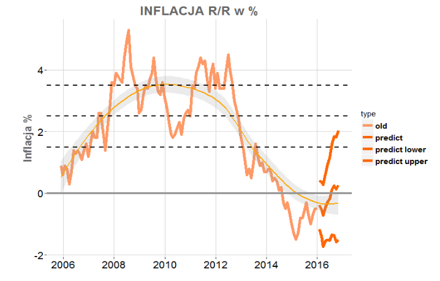

# Inflacja
Wpływ inflacji na codzienne życie Polaków nie jest może tak zauważalny jak nominalny wzrost
gotówki w ich portfelach. Odgrywa ona jednak kluczową rolę w kształtowaniu polityki monetarnej i
rozwoju całej gospodarki. Ostatni światowy kryzys sprawił co prawda, że ograniczanie inflacji
zniknęło z agendy największych banków centralnych na świecie. Strach przed deflacją sprawił z
kolei, że do zestawu tradycyjnych narzędzi polityki monetarnej włączono nowe, niekonwencjonalne
metody. Ujemne stopy procentowe oraz przeprowadzane na znaczącą skalę luzowanie ilościowe nie
doprowadziło jednak do pozbycia się problemu. Również Polska od pewnego czasu znajduje się w
objęciach deflacji. Ubiegłoroczny spadek cen surowców energetycznych oraz żywności skutecznie
obniżył wartość koszyka inflacyjnego, a najnowsza projekcja NBP nie wskazuje na przekroczenie
poziomu 0% w ciągu najbliższych miesięcy.

Model przygotowany przez Fundację Rozwoju Zawodowego „Quantitative Finance” ma na
celu udzielić odpowiedzi na pytanie o poziom inflacji w 2016 roku. Na podstawie analizy statystycznej
zestawu danych dotyczących Polski, UE oraz USA z lat 2005-2016, wybrano najważniejsze czynniki
mające wpływ na obecną sytuację inflacyjną Polski. W modelu wykorzystano: ceny ropy naftowej,
stopę bezrobocia, kurs USD/PLN, ceny towarów mierzonych indeksem Bloomberg Commodity oraz
ubiegłomiesięczną zmianę poziomu inflacji. Zgodnie z wynikami modelu inwestorzy powinni
spodziewać się odwrócenia deflacyjnego trendu, a średnioroczna inflacja w 2016 roku powinna
wynieść 0.27%.

Odwrócenia trendu spodziewają się również ankietowani (próba 77 osób) przez Związek
Maklerów i Doradców profesjonaliści rynku kapitałowego, których średnie wskazanie wynosi 0.4%.
Ucieczka od deflacji wydaje się być przesądzona. Świadomi inwestorzy powinni zdawać sobie
sprawę, że oznacza to początek końca rekordowo niskich stóp procentowych, co w konsekwencji
przełoży się również na spadek cen wyemitowanych już instrumentów dłużnych, wzrost rentowności
nowych emisji obligacji oraz wzrost kosztów kredytowania. Ten pakiet może okazać się kolejnym
ciosem w inwestorów giełdowych, jeśli do tego czasu warszawski parkiet nie wypracuje sobie
silniejszych fundamentów do wzrostów.

Fundacja Rozwoju Zawodowego
„Quantitative Finance”
fundacja@quantitativefinance.org.pl
www.quantitativefinance.org.pl
